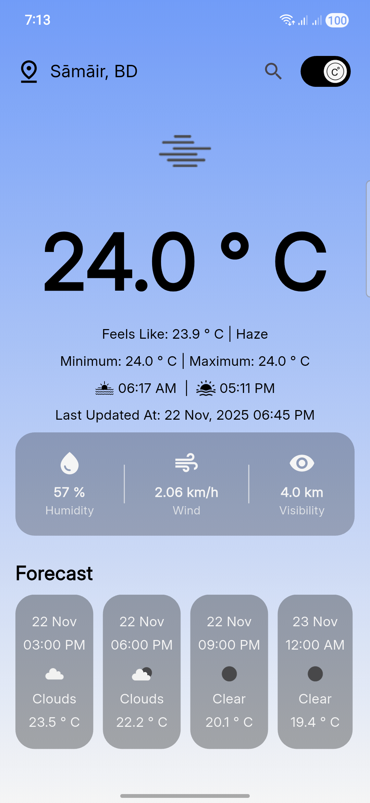
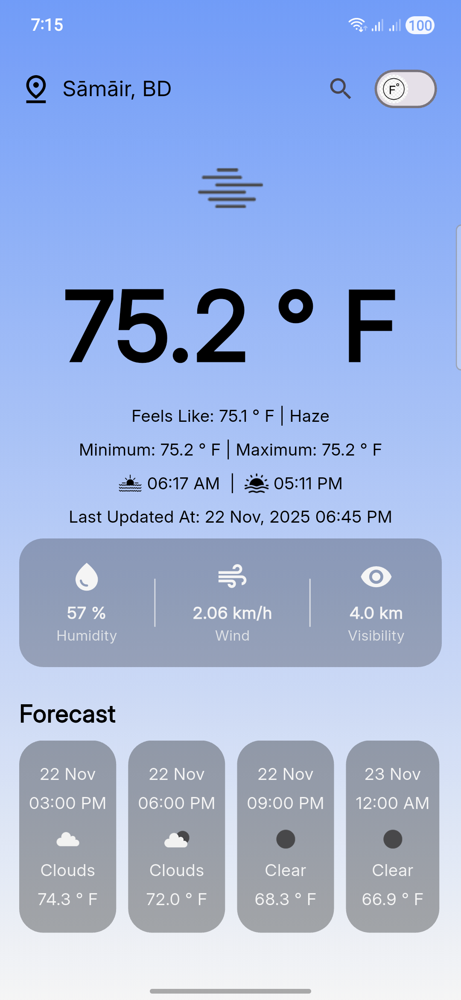

# 🌤️ Weather App

A simple and beautiful Flutter weather application that provides
**current weather**, **forecast**, **city search**, and **multi-unit
temperature modes**.\
Built using **OpenWeather API**, **GetX**, **Dio**, **Freezed**, and
**Shared Preferences**.

------------------------------------------------------------------------

## 🚀 Features

-   📍 **Location-based current weather**
-   📅 **5-day forecast weather**
-   🔍 **Search weather by city name**
-   🌡️ **Multi-mode temperature unit**
    -   Celsius (°C)
    -   Fahrenheit (°F)
-   🗂️ **State management with GetX**
-   🔧 **Clean architecture with Freezed models**
-   📦 **Local persistence using SharedPreferences**
-   🌐 **API integration using Dio**
-   🔑 **Environment variable handling with flutter_dotenv**

------------------------------------------------------------------------

## 🛠️ Technologies Used

Tech                       Purpose
  -------------------------- -------------------------------
**Flutter (FVM) 3.38.0**   UI framework
**GetX**                   State management, DI, routing
**Dio**                    Networking
**Freezed**                Data models
**Shared Preferences**     Local storage
**flutter_dotenv**         API key management
**OpenWeather API**        Weather data source

------------------------------------------------------------------------

## 📦 Project Setup

Follow the steps below to run the project locally.

### 1️⃣ Install Flutter (FVM recommended)

If you use FVM:

``` sh
fvm use 3.38.0
fvm flutter pub get
```

If you use standard Flutter:

``` sh
flutter pub get
```

------------------------------------------------------------------------

### 2️⃣ Add your `.env` file

Create a file in the project root:

    .env

Add your OpenWeather API key:

    API_KEY=YOUR_API_KEY

⚠️ Replace `YOUR_API_KEY` with your actual key from
https://openweathermap.org/api

------------------------------------------------------------------------

### 3️⃣ Run the project

Using FVM:

``` sh
fvm flutter run
```

Or standard Flutter:

``` sh
flutter run
```

------------------------------------------------------------------------

## 📸 Screenshots

### 🌤 Current Weather & Forecast

<div style="display: flex; gap: 10px;">
  
  
</div>

### 🔍 Search City

<div style="display: flex; justify-content: center;">
  
</div>


------------------------------------------------------------------------

## 🧩 Folder Structure (Simplified)

    lib/
     ├─ src/
     │   ├─ core/
     │   ├─ data/
     │   │   ├─ local/
     │   │   ├─ models/
     │   │   └─ remote/
     │   ├─ module/
     │   │   ├─ home/
     │   │   │   ├─ bindings/
     │   │   │   ├─ controllers/
     │   │   │   ├─ views/
     │   │   │   └─ widgets/
     │   │   └─ splash/
     │   │   │   ├─ bindings/
     │   │   │   ├─ controllers/
     │   │   │   ├─ views/
     │   │   │   └─ widgets/
     │   └─ application.dart
     ├─ main.dart

------------------------------------------------------------------------

## 💬 API Reference

Data is fetched from **OpenWeather API**:\
https://openweathermap.org/api

------------------------------------------------------------------------

## 📄 License

This project is open-source and free to use.

------------------------------------------------------------------------

## 🤝 Contributing

Pull requests are welcome. Suggestions and improvements are appreciated!

------------------------------------------------------------------------

### ⭐ If you like this project, don't forget to star the repo!
